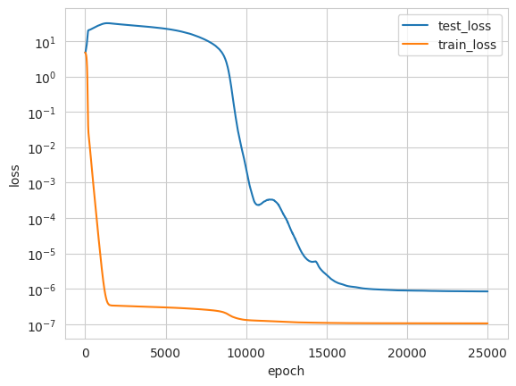
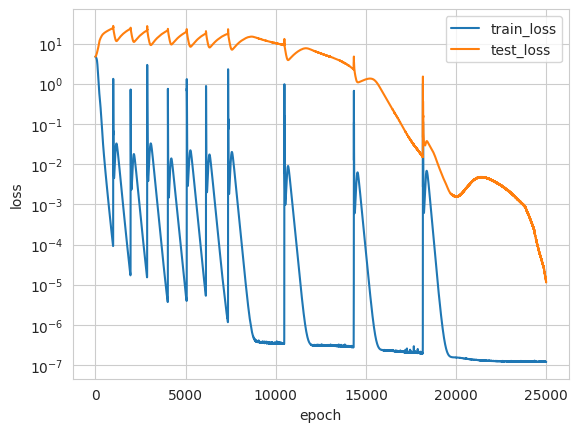

# Grokking
Experiments based on [Progress measures for grokking via mechanistic interpretability](https://arxiv.org/abs/2301.05217)

# Plan

1. Extend grokking experiments to do multiple operations (start with + and - then move to more disparate operations)
2. Check it groks (does it grok together?)
3. Reverse engineer the circuits to compare to the above paper
4. Investigate variations - training in stages, can grokking be hidden by training on many different operations.

# Progress

1. Reproduced original grokking.  and have extended to work with multiple operations by adding an extra operation token between the two numbers (see modular_addition.py)

2. Shown that it does grok (albeit not so cleanly).

 . 

This graph has lots of "slingshots" ([The Slingshot Mechanism: An Empirical Study of Adaptive Optimizers and the Grokking Phenomenon](https://arxiv.org/abs/2206.04817)). [Progress measures for grokking via mechanistic interpretability](https://arxiv.org/abs/2301.05217) suggests that these may be caused by rounding errors. As shown in the original graph, these shouldn't be necessary for grokking so I may be able to tune them out by adjusting the train-test data ratio or other hyper-parameters. I have already seen that doing this can affect the number of slingshots that happen.